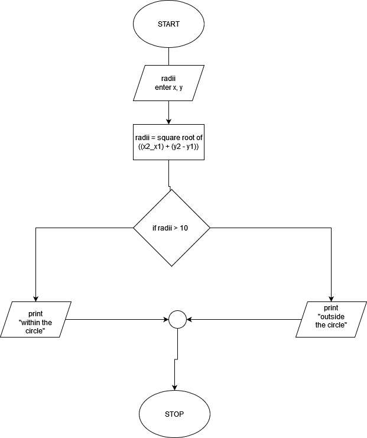
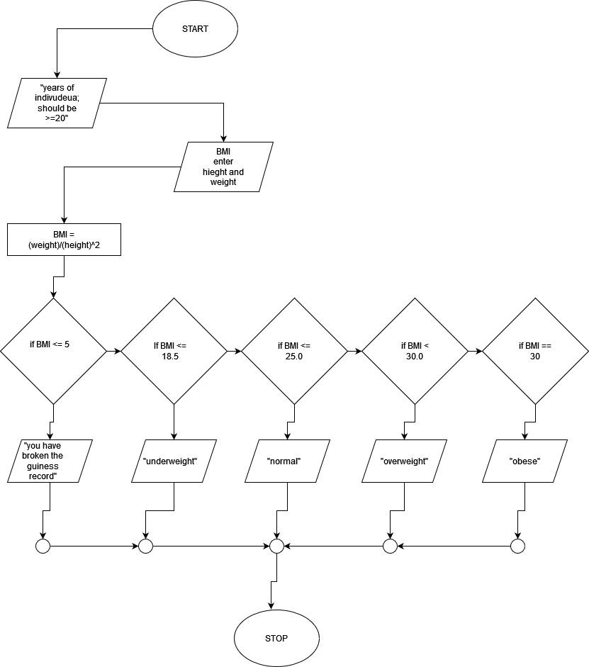

### File 1
* A program is required that prompts the user to enter point (x,y) and checks if point is within a circle centered (0,0) with a radius 10
* For example (4, 5) is inside the circle and (9, 9)is outside the circle.
* Hint: a point is in the circle if distance between (x, y) and center of the circle is less than or equal to radius.
* the formular for computing distance is 

```
√((x2 - x1) + (y2 - y1))

```


### File 2
* Body Mass Index (BMI) is a measure of health based on height and weight. It can
be calculated by taking your weight in kilograms and dividing it by the square of
your height in meters.
* The interpretation of BMI for people 20 years or older is as
follows: BMI Interpretation BMI < 18.5 Underweight 18.5 ≤ BMI < 25.0 Normal
25.0 ≤ BMI < 30.0 Overweight 30.0 ≤ BMI Obese Write a program that prompts
the user to enter a weight in pounds and height in inches and displays the BMI.
* Note that one pound is 0.45359237 kilograms and one inch is0.0254 meters


